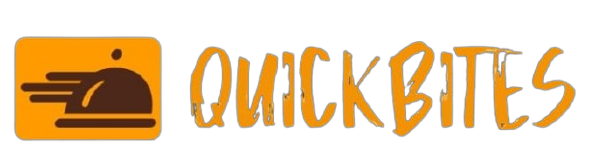
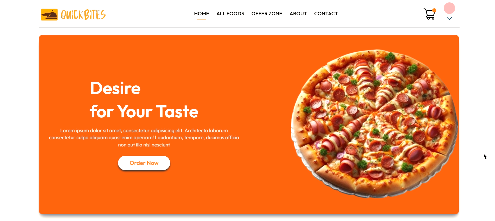

# 

# QuickBites: Online Food Ordering System

QuickBites is a modern **QuickBites - Online Dining Solutions** designed for admins to manage orders efficiently. Built with a **React** frontend, **Node.js** backend, and **MongoDB** as the database, the project leverages **Tailwind CSS** for clean and responsive UI design.

## 🚀 Features

### Admin Panel
- 📝 **Order Management**: Add, update, or remove orders with ease.
- 🍽️ **Menu Management**: Create and manage food items dynamically.
- 📊 **Dashboard**: View live updates of incoming orders and performance.
- 🧑‍🍳 **User-Friendly UI**: Tailored for admin users to manage the food delivery system.

### Tech Stack
- ⚛️ **Frontend**: React.js + Tailwind CSS
- 🛠️ **Backend**: Node.js + Express.js
- 🗄️ **Database**: MongoDB
- 🔗 **REST API**: Built with Express.js for CRUD operations

## 🎨 UI Highlights
- Modern and clean interface built with **Tailwind CSS**
- Responsive design for all screen sizes
- Easy-to-navigate admin controls for efficient workflow

---

## 🛠️ Installation
Follow these steps to set up the project locally:

### Prerequisites
- **Node.js** (v14+)
- **MongoDB** (installed locally or use MongoDB Atlas)

### Steps
1. **Clone the repository**
   ```bash
   git clone https://github.com/yourusername/quickbites.git
   cd quickbites
   ```
2. **Install dependencies** for both frontend and backend:
   ```bash
   # Backend setup
   cd server
   npm install

   # Frontend setup
   cd ../client
   npm install
   ```
3. **Setup Environment Variables**
   Create a `.env` file in the `server` directory:
   ```plaintext
   MONGO_URI=your_mongodb_connection_string
   PORT=5000
   ```
4. **Run the Project**
   Open two terminals for frontend and backend:
   ```bash
   # Run backend
   cd server
   npm start

   # Run frontend
   cd client
   npm start
   ```

5. **Access the App**
   Go to `http://localhost:3000` in your browser.

---

## 📂 Project Structure
```
QuickBites/
│
├── server/              # Backend (Node.js + Express)
│   ├── models/          # MongoDB Schemas
│   ├── routes/          # API Routes
│   ├── .env             # Environment Variables
│   └── server.js        # Entry point
│
├── client/              # Frontend (React + Tailwind CSS)
│   ├── src/
│   │   ├── components/  # Reusable Components
│   │   ├── pages/       # App Pages (Dashboard, Menu, etc.)
│   │   ├── App.js       # Root Component
│   │   └── index.css    # Tailwind CSS Config
│
└── README.md            # Project Documentation
```

## 🖼️ Screenshot


---

## 🤝 Contributing
Contributions are always welcome! To contribute:
1. Fork the repository.
2. Create a new branch.
3. Make your changes.
4. Submit a pull request.

---

## 📧 Contact
- **Project Author**: Ridham,Dhrvik,Milan,Rushik,Dishant,Jenish
- **Email**: savaliyaridham46@gmail.com.com

---

## ⭐ Show Your Support
If you like this project, give it a ⭐ on GitHub!

---

Made with ❤️ by Ridham,Dhrvik,Milan,Rushik,Dishant,Jenish.
